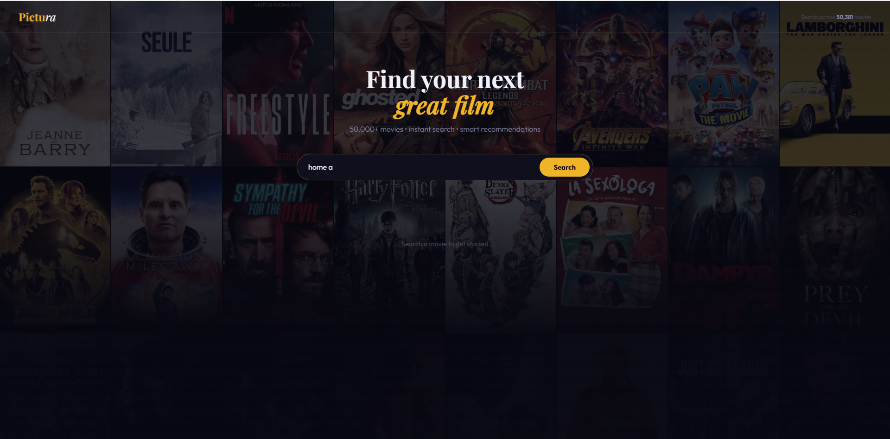
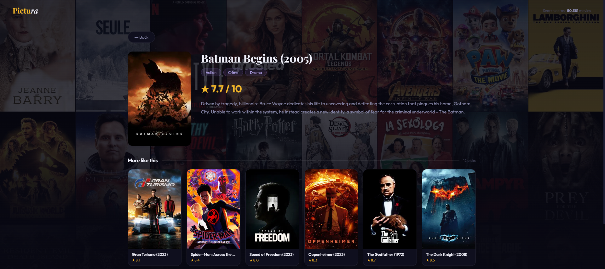

# 🎬 Pictura — Movie Recommendation System

A content-based movie recommendation web app built with **FastAPI** and **Python**, powered by a dataset of 50,000+ real movies from TMDB. Search any movie, get smart recommendations, and explore details — all running locally with no paid API required.


---

## 🖥️ Screenshots





---

## ✨ Features

- **Instant search** across 50,000+ movies with live suggestions as you type
- **Smart recommendations** using content-based filtering with Bayesian scoring
- **Movie detail page** — click any movie to see its poster, genres, rating, overview, and more picks
- **Cinematic UI** — dark theme with a movie poster collage background, gold accents, and smooth hover effects
- **Zero API dependency** — search and recommendations run entirely from local data
- **REST API** with clean endpoints, built on FastAPI

---

## 🧠 How It Works

1. **Dataset** — The TMDB Kaggle dataset (1.4M rows) is cleaned and filtered down to ~50K high-quality released movies with sufficient vote counts
2. **Scoring** — Each movie gets a Bayesian score balancing vote average and popularity, so classics beat obscure 10/10 films
3. **Search** — Fast local string matching across all 50K titles, ranked by exact match first then score
4. **Recommendations** — Finds movies sharing genres with the searched film, scored by genre overlap + Bayesian rating
5. **Posters** — Loaded from TMDB's image CDN using stored poster paths

---

## 🛠️ Tech Stack

| Layer | Technology |
|---|---|
| Language | Python 3.8+ |
| Web Framework | FastAPI + Uvicorn |
| Data Processing | Pandas, NumPy |
| Dataset | TMDB Movies Dataset (Kaggle) |
| Frontend | Vanilla HTML/CSS/JS |
| Fonts | Playfair Display, Outfit (Google Fonts) |

---

## 📁 Project Structure

```
pictura/
├── data/
│   ├── TMDB_movie_dataset_v11.csv   ← raw dataset (download from Kaggle)
│   └── movies_clean.csv             ← generated by prepare_data.py
├── app.py                           ← FastAPI app + UI
├── recommender.py                   ← search, scoring, recommendations
├── prepare_data.py                  ← cleans raw dataset into movies_clean.csv
├── requirements.txt
└── README.md
```

---

## 🚀 Getting Started

### 1. Clone the repo
```bash
git clone https://github.com/Anand-R22/pictura.git
cd pictura
```

### 2. Create and activate a virtual environment
```bash
python -m venv venv

# Windows
venv\Scripts\activate

# Mac/Linux
source venv/bin/activate
```

### 3. Install dependencies
```bash
pip install -r requirements.txt
```

### 4. Download the dataset
Go to [Kaggle — TMDB Movies Dataset](https://www.kaggle.com/datasets/asaniczka/tmdb-movies-dataset-2023-930k-movies/data) and download `TMDB_movie_dataset_v11.csv`. Place it inside the `data/` folder.

### 5. Prepare the dataset (run once)
```bash
python prepare_data.py
```
This cleans the 1.4M row raw CSV into a lean 50K movie dataset saved as `data/movies_clean.csv`.

### 6. Run the app
```bash
uvicorn app:app --reload
```

Open your browser at **http://localhost:8000**

---

## 📡 API Endpoints

| Method | Endpoint | Description |
|--------|----------|-------------|
| `GET` | `/` | Main web UI |
| `GET` | `/suggest?q=batman` | Live search suggestions (top 6) |
| `GET` | `/search?q=batman` | Full search — matched movie + recommendations |
| `GET` | `/movie/{id}` | Movie detail + similar picks |
| `GET` | `/posters` | Random poster paths for background collage |

---

## 💡 Key Technical Decisions

**Bayesian scoring** — Instead of sorting purely by vote average (which would put obscure 10/10 films above The Godfather), movies are ranked using a Bayesian average that weighs vote count alongside rating. This gives results that feel natural and trustworthy.

**Local-first architecture** — All search and recommendations run from the local CSV with no network calls, making the app fast and reliable. TMDB's image CDN is used only for loading poster images.

**Content-based filtering** — Recommendations are based on genre overlap and Bayesian score. A movie sharing 3 genres with the searched film ranks higher than one sharing only 1. This produces intuitive results without needing a user ratings matrix.

---

## 📊 Dataset

- **Source:** [TMDB Movies Dataset 2023](https://www.kaggle.com/datasets/asaniczka/tmdb-movies-dataset-2023-930k-movies) by asaniczka on Kaggle
- **Raw size:** 1,407,834 movies
- **After cleaning:** ~50,381 released movies with ≥20 votes, no adult content
- **License:** CC0 Public Domain

---

## 🔮 Future Improvements

- [ ] Add genre filter chips on the home page
- [ ] User accounts and watchlist feature
- [ ] Collaborative filtering using user ratings
- [ ] Deploy to Railway or Render for public access
- [ ] Add trailer links via YouTube API
- [ ] Mobile-optimised layout

---

## 👤 Author

**Anand R**
[GitHub](https://github.com/Anand-R22) · [LinkedIn](https://linkedin.com/in/YOUR_LINKEDIN_USERNAME)
